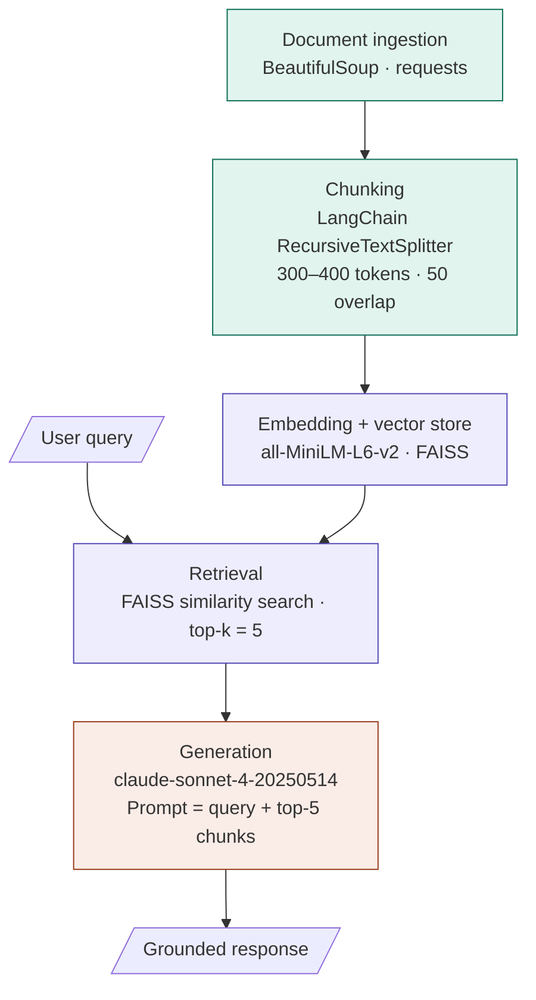

# Project 1 Planning: The Unofficial Guide

> Write this document before you write any pipeline code.
> Your spec and architecture diagram are what you'll use to direct AI tools (Claude, Copilot, etc.) to generate your implementation — the more specific they are, the more useful the generated code will be.
> Update the Retrieval Approach and Chunking Strategy sections if you change your approach during implementation.
> Update this file before starting any stretch features.

---

## Domain

<!-- What domain did you choose? Why is this knowledge valuable and hard to find through official channels? -->
**Domain:** Student reviews and peer-generated suggestions for campus survival guides.

This domain focuses on informal student knowledge about how to navigate campus life, including practical advice, hidden challenges, useful resources, and everyday survival tips that are often learned through experience rather than official materials.

This knowledge is valuable because it gives incoming or current students realistic insight into campus life from the student perspective. It can help students make better decisions, avoid common mistakes, find helpful resources, and feel more prepared.

This information is hard to find through official channels because university guides usually present polished, general, or policy-focused information. They often leave out lived experiences, unofficial advice, student shortcuts, honest warnings, and practical tips that students usually discover on their own or through conversations with peers.

---

## Documents

<!-- List your specific sources: URLs, subreddit names, forum threads, or file descriptions.
     Aim for at least 10 sources that together cover different subtopics or perspectives within your domain. -->

#	Source	Description & subtopics	URL
1	Reddit
r/college	Massive student community sharing firsthand campus tips, dorm life, financial aid hacks, and "things I wish I knew" threads. Crowd-sourced and unfiltered.
housingclassesmental healthcampus jobs
reddit.com/r/college
2	Review site
Niche.com	Student-written reviews rating housing, food, safety, and social life at thousands of schools. Includes candid Q&A summaries from current and former students.
housingfoodsafetysocial life
niche.com/colleges
3	Review site
RateMyProfessors	Largest student-run professor and campus review database in the US. Covers teaching style, grading difficulty, and overall course experience.
classesacademics
ratemyprofessors.com
4	Campus paper
The Daily Pennsylvanian	Student-written dorm tips from Penn underclassmen: mattress pads, food storage, laundry habits, and making friends on your hall. Candid peer advice.
housingsocial lifelife hacks
thedp.com
5	Campus paper
Advance-Titan (UW Oshkosh)	Student survival guide covering night safety (free escort rides, blue-light stations), dorm neighbor etiquette, and textbook tips. Written by a current student.
safetytransportationhousing
advancetitan.com
6	Student blog
UMass SBS Pathways	Multi-student advice post from juniors, seniors, and alumni sharing honest reflections on classes, campus jobs, friendships, and managing overwhelm.
classescampus jobsmental healthhidden resources
sbspathways.umass.edu
7	Student blog
Her Campus LMU	Student-written piece on underappreciated college perks: free campus events with food, off-campus exploration, and using downtime for mental wellness.
foodmental healthsocial lifehidden resources
hercampus.com
8	News article
NBC News — "13 Things"	First-person tips from 13 real college students across multiple US universities on money, diversity, time management, and using campus resources effectively.
foodfinancessocial lifeclasses
nbcnews.com
9	Q&A forum
Quora thread	Crowdsourced advice on the most valuable college experiences — budgeting, cross-disciplinary learning, networking, and discovering hidden campus services.
hidden resourcesfinancesclassescampus jobs
quora.com
10	YouTube
College Survival Guide video	Student vlog sharing honest first-year mistakes and lessons learned. Comment sections add additional peer tips. Covers study habits, social adjustments, and campus navigation.
study spacessocial lifemental healthclasses
youtube.com

---

## Chunking Strategy

<!-- How will you split documents into chunks?
     State your chunk size (in tokens or characters), overlap size, and explain why those
     numbers fit the structure of your documents.
     A review-heavy corpus warrants different chunking than a long FAQ. -->

**Chunk size:** 3000-400 tokens

**Overlap:** 50 tokens 

**Reasoning:**
The source corpus is made up of short-form, conversational student advice —
Reddit comments, review snippets, Q&A answers, and blog tips. Meaning is
highly localized: one paragraph or list item typically contains one complete
piece of advice.

A 300–400 token window matches that natural unit. Larger chunks (e.g. 800–1,000
tokens) would blend unrelated tips from the same post — a query about food
should not retrieve a chunk that is mostly about study habits just because
dining is mentioned once. Smaller chunks (e.g. 100 tokens) strip sentences of
their context, making individual tips uninterpretable in isolation.

A 50-token overlap prevents advice from being cut mid-thought at chunk
boundaries. Student writing frequently uses sequential connectors ("First…",
"Also…", "On top of that…"), so a small overlap ensures those continuations
are not orphaned in the next chunk. The overlap is intentionally conservative —
if retrieval misses tips that span paragraph breaks, increasing to 75–100 tokens
is a reasonable adjustment.

---

## Retrieval Approach

<!-- Which embedding model are you using (e.g., all-MiniLM-L6-v2 via sentence-transformers)?
     How many chunks will you retrieve per query (top-k)?
     If you were deploying this for real users and cost wasn't a constraint, what tradeoffs
     would you weigh in choosing a different embedding model — context length, multilingual
     support, accuracy on domain-specific text, latency? -->

**Embedding model:** sentence-transformers/all-MiniLM-L6-v2

**Top-k:** 5

**Production tradeoff reflection:**
- **Domain specificity.** General-purpose models are not trained on student slang
  or campus vocabulary ("meal swipe", "RA", "blue light", "flex dollars"). A model
  fine-tuned on student-generated text, or re-ranked with a cross-encoder, would
  likely return more precise results for niche queries.

- **Context length.** If chunking strategy changes — for example, to accommodate
  longer Reddit threads or full blog posts — a model with a longer context window
  such as text-embedding-3-large (8,191 tokens) or instructor-xl would handle that
  without re-chunking the corpus.

- **Multilingual support.** This corpus is English-only, so multilingual models
  (e.g. paraphrase-multilingual-MiniLM-L12-v2) offer no benefit here. If the
  project expanded to include international student forums, that tradeoff would
  shift.

- **Latency vs. accuracy.** Larger models like text-embedding-3-large or
  instructor-xl produce stronger embeddings but are slower and costlier per
  query. For a low-traffic research tool, that cost is acceptable. At scale,
  a two-stage approach — fast ANN retrieval with a smaller model, followed by
  cross-encoder re-ranking on the top-20 — balances both.

---

## Evaluation Plan

<!-- List your 5 test questions with their expected correct answers.
     Questions should be specific enough that you can judge whether the system's response
     is right or wrong. "What are good dining halls?" is too vague.
     "What do students say about wait times at [dining hall name] during lunch?" is testable. -->
## Evaluation Plan

<!-- List your 5 test questions with their expected correct answers.
     Questions should be specific enough that you can judge whether the system's response
     is right or wrong. "What are good dining halls?" is too vague.
     "What do students say about wait times at [dining hall name] during lunch?" is testable. -->

| # | Question | Expected answer |
|---|----------|-----------------|
| 1 | What do students at Penn say about the quality of dorm mattresses and what do they recommend bringing? | Students report that Penn dorm mattresses are low quality — described as barely above a plastic box — and recommend investing in a quality mattress pad before arriving. (Source: The Daily Pennsylvanian dorm tips article) |
| 2 | What free late-night transportation option do UW Oshkosh students recommend for walking alone at night? | Students recommend calling UWO-Go, a free campus ride service, when travelling alone at night or going somewhere too far to walk. (Source: Advance-Titan freshman survival guide) |
| 3 | What specific mental health accommodation did the student author of Alex's Declassified College Survival Guide obtain, and what was the outcome? | The student requested a single dorm room as a disability accommodation after previous roommate experiences caused anxiety. Their therapist wrote supporting documentation, and living alone significantly improved their mental health. (Source: Families for Depression Awareness blog) |
| 4 | According to Niche student reviews, what is one recurring housing complaint at UC Santa Barbara? | Students report that off-campus housing in Isla Vista is expensive and that many apartments and houses have a mold problem. (Source: Niche.com best student life rankings) |
| 5 | What do UMass students advise about taking classes outside your major during the first year? | Multiple UMass students advise freshmen to take classes outside their major early on, meet with an advisor to explore the course catalog, and follow what genuinely excites them rather than locking into a narrow path too soon. (Source: UMass SBS Pathways peer advice blog) |
---

## Anticipated Challenges

<!-- What could go wrong? Name at least two specific risks with reasoning.
     Consider: noisy or inconsistent documents, missing source attribution, off-topic
     retrieval, chunks that split key information across boundaries. -->

1. **Temporal decay of student advice.** Much of the corpus was published between
   2014 and 2024. Campus-specific details — dining hall names, shuttle routes,
   free service availability, housing lottery rules — change frequently. A chunk
   from a 2016 Daily Pennsylvanian article may confidently describe a policy or
   resource that no longer exists. Because the text reads as authoritative student
   voice, the system has no built-in signal that the information is stale. Without
   a `published_date` metadata field and either a recency filter or a disclaimer
   injected at generation time, the system risks surfacing outdated advice as if
   it were current fact.

2. **Institution bleed in retrieval.** Many tips in this corpus are school-specific
   but phrased generically ("the dining hall", "the library", "campus safety").
   Without strong institution-level metadata filtering, a query like "what do
   students say about late-night safety on campus?" may return chunks from three
   different universities blended into a single answer. The response would read as
   coherent but would be a composite of advice from institutions with different
   resources, layouts, and policies — potentially misleading for a student at any
   one of them. This risk is highest for subtopics like transportation and housing
   where details are highly local and surface-level language is nearly identical
   across sources.
---

## Architecture

<!-- Draw a diagram of your pipeline showing the five stages:
     Document Ingestion → Chunking → Embedding + Vector Store → Retrieval → Generation
     Label each stage with the tool or library you're using.
     You can use ASCII art, a Mermaid diagram, or embed a sketch as an image.
     You'll use this diagram as context when prompting AI tools to implement each stage. -->
## Architecture

---

## AI Tool Plan

<!-- For each part of the pipeline below, describe:
     - Which AI tool you plan to use (Claude, Copilot, ChatGPT, etc.)
     - What you'll give it as input (which sections of this planning.md, which requirements)
     - What you'll expect it to produce
     - How you'll verify the output matches your spec

     "I'll use AI to help me code" is not a plan.
     "I'll give Claude my Chunking Strategy section and ask it to implement chunk_text()
     with my specified chunk size and overlap" is a plan. -->

**Milestone 3 — Ingestion and chunking:**

- **Tool:** Claude (claude-sonnet-4-20250514 via claude.ai)
- **Input:** The Sources table (all 12 URLs and source types), the Chunking Strategy
  section (300–400 token chunk size, 50-token overlap, split-on-paragraph-boundary
  logic, metadata schema), and the Architecture diagram stage labels.
- **Expected output:** Two Python functions — `ingest_sources(urls: list[str]) -> list[dict]`
  that fetches and cleans raw text from each URL using requests and BeautifulSoup,
  and `chunk_text(doc: dict) -> list[dict]` that uses LangChain's
  `RecursiveCharacterTextSplitter` with `chunk_size=400`, `chunk_overlap=50`, and
  attaches `source_type`, `subtopic`, `url`, and `published_date` metadata to each
  chunk as specified in the Chunking Strategy section.
- **Verification:** Run both functions against source #4 (The Daily Pennsylvanian)
  and source #1 (r/college). Confirm that (a) no chunk exceeds 420 tokens when
  measured with `tiktoken`, (b) every chunk dict contains all four metadata keys,
  and (c) the overlap between consecutive chunks is 40–60 tokens. Fail on any
  assertion that doesn't hold before proceeding.

---

**Milestone 4 — Embedding and retrieval:**

- **Tool:** Claude (claude-sonnet-4-20250514 via claude.ai)
- **Input:** The Embedding section (model: `all-MiniLM-L6-v2`, top-k = 5, rationale
  for 256-token context ceiling), the Architecture diagram (FAISS as the vector
  store), and the output schema from Milestone 3 (list of chunk dicts with metadata).
- **Expected output:** Two functions — `build_index(chunks: list[dict]) -> faiss.Index`
  that encodes all chunks with `sentence-transformers/all-MiniLM-L6-v2` and stores
  vectors in a FAISS `IndexFlatL2` alongside a parallel metadata list, and
  `retrieve(query: str, index, metadata, k: int = 5) -> list[dict]` that embeds the
  query with the same model and returns the top-k chunk dicts including their
  metadata and similarity scores.
- **Verification:** Run `retrieve()` against each of the 5 evaluation questions from
  the Evaluation Plan. For each query, confirm that (a) exactly 5 chunks are returned,
  (b) the expected source (as named in the Expected Answer column) appears in the top-5
  results, and (c) the returned `subtopic` metadata is plausible for the query. Log
  any query where the expected source is absent as a retrieval failure before moving
  to Milestone 5.

---

**Milestone 5 — Generation and interface:**

- **Tool:** Claude (claude-sonnet-4-20250514 via claude.ai) for code generation;
  the same model via the Anthropic API as the generation engine at runtime.
- **Input:** The Architecture diagram (generation stage: prompt = query + top-5 chunks),
  the Anticipated Challenges section (temporal decay and institution bleed risks),
  the Evaluation Plan (5 test questions and expected answers), and the retrieve()
  output schema from Milestone 4.
- **Expected output:** A `generate(query: str, chunks: list[dict]) -> str` function
  that builds a prompt instructing the model to answer using only the provided chunks,
  cite the `source_title` of any chunk it draws from, and append a disclaimer if any
  chunk's `published_date` is more than 3 years old. Also a minimal CLI interface:
  `python main.py --query "..."` that runs the full pipeline end-to-end and prints
  the response with citations.
- **Verification:** Run all 5 evaluation questions through the complete pipeline.
  Score each response on three criteria: (a) factual match — does the answer align
  with the Expected Answer in the Evaluation Plan, (b) citation presence — does the
  response name the correct source, and (c) no hallucination — does the response
  avoid stating facts not present in the retrieved chunks. A response must pass all
  three criteria to count as correct. Target: 4 out of 5 before submission.